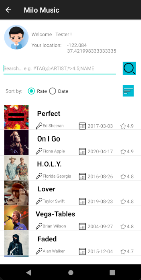
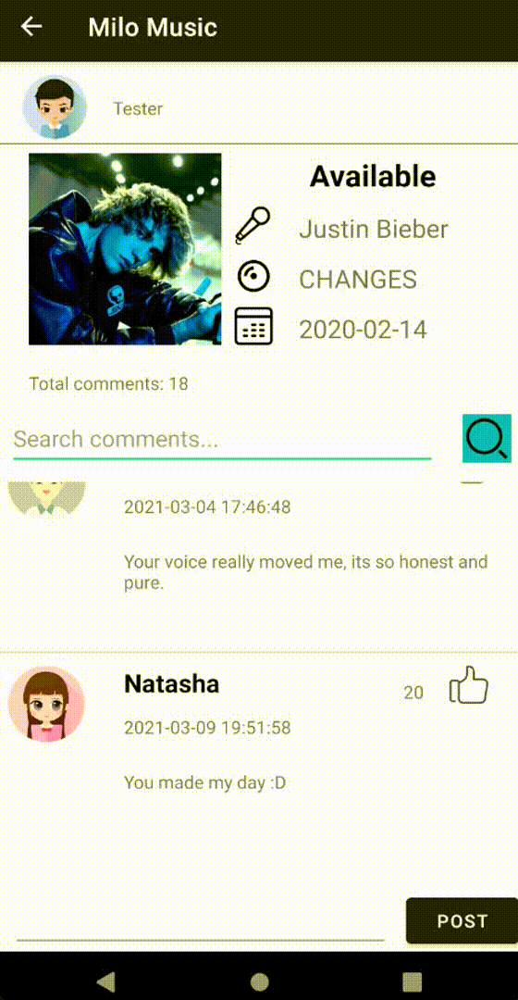
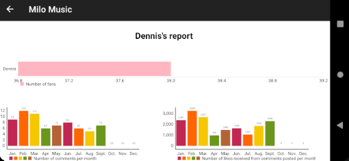
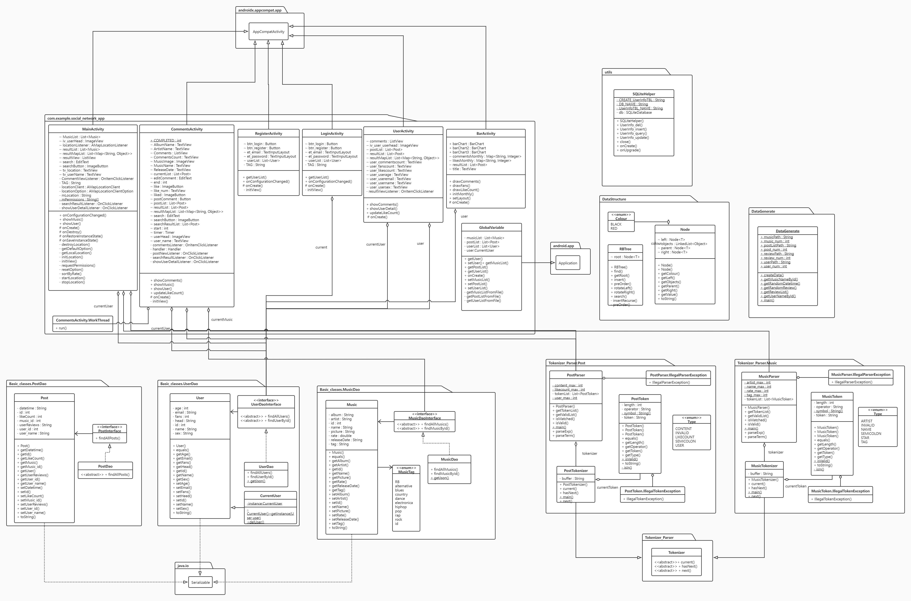

# [Team Name] Report

The following is a report template to help your team successfully provide all the details necessary for your report in a structured and organised manner. Please give a straightforward and concise report that best demonstrates your project. Note that a good report will give a better impression of your project to the reviewers.

*Here are some tips to write a good report:*

* *Try to summarise and list the `bullet points` of your project as much as possible rather than give long, tedious paragraphs that mix up everything together.*

* *Try to create `diagrams` instead of text descriptions, which are more straightforward and explanatory.*

* *Try to make your report `well structured`, which is easier for the reviewers to capture the necessary information.*

*We give instructions enclosed in square brackets [...] and examples for each sections to demonstrate what are expected for your project report.*

*Please remove the instructions or examples in `italic` in your final report.*

## Table of Contents

1. [Team Members and Roles](#team-members-and-roles)
2. [Conflict Resolution Protocol](#conflict-resolution-protocol)
2. [Application Description](#application-description)
3. [Application UML](#application-uml)
3. [Application Design and Decisions](#application-design-and-decisions)
4. [Summary of Known Errors and Bugs](#summary-of-known-errors-and-bugs)
5. [Testing Summary](#testing-summary)
6. [Implemented Features](#implemented-features)
7. [Team Meetings](#team-meetings)

## Team Members and Roles

| UID | Name | Role |
| :--- | :----: | ---: |
| [uid] | [name] | [role] |
| [uid] | [name] | [role] |
| [uid] | [name] | [role] |
| [uid] | [name] | [role] |

## Conflict Resolution Protocol

### Conflict with a Team member
Any conflict that arises with members of the project team will require the individual involved in
the conflict to contact the Project Manager. The Project Manager will arrange and facilitate a
meeting with the aggrieved parties accompanied by a detailed description of each individual's
comments and concerns. If the conflict in question involves the Project Manager then a Team
Member who is not involved in the conflict will fill the role of Project Manager for the purposes of
resolving this specific conflict. The meeting will begin with each person, in no particular order,
individually explaining their concerns and discussing them openly. Notes will be taken
throughout this process including key comments and desired outcomes. The purpose of this
meeting is for all parties to come to a mutual understanding and reach a resolution to the
aforementioned conflict. If a solution cannot be agreed upon, the conflict will be escalated and
require mediation as described in the Mediation part.

### Conflict with the Convenor
Any conflict that arises with the Convenor will require the individual, or individuals, involved in
the conflict to contact the Project Manager. The Project Manager will arrange and facilitate a
meeting with the aggrieved parties accompanied by a detailed description of each individual's
comments and concerns. If the conflict in question involves the Project Manager then a Team
Member who is not involved in the conflict will fill the role of Project Manager for the purposes of
resolving this specific conflict. The meeting will begin with each person, in no particular order,
individually explaining their concerns and discussing them openly. Notes will be taken
throughout this process including key comments and desired outcomes. The purpose of this
meeting is for all parties to come to a mutual understanding and reach a resolution to the
aforementioned conflict. If a solution cannot be agreed upon, the conflict will be escalated and
require mediation as described in the Mediation part.

### Mediation
In the unlikely event that an event of conflict can not be resolved it will require mediation from a
third party. This can be at the request of the aggrieved parties if they believe they can not
resolve the conflict through the usual means. It is the responsibility of the Project Manager to
organise an appropriate person to undertake mediation. If there is a conflict of interest with the
Project Manager, the next appropriate individual will be the Assessor followed by the Course
Convenor.

## Application Description

MiloMusic is a music social media application specifically targeting all people who love music. It provides three parts for them, which are music, comments, and user.

- In the music part, a list of songs are showed in descending order of date or score. Therefore, user can get the latest and highest score song. User also can search songs by four methods.
- In the comments part, user can view posts on a timeline activity (update every 3 seconds). Similarly, user can search comments by three methods. In addition, user can post their comments.
- The user part is open for every users, user can view their comments and a report for their activities.

<center class="third">



</center>

<center class="half">


</center>

**Application Use Cases and or Examples**

Dennis wants to get the most popular song in the playlist and see the comments

1. He accesses the MiloMusic application and goes to the music page
2. He clicks the Rate button and see the top 1 song
3. He chooses the "Perfect" written by Ed Sheeran and goes to the comments page

Mia wants to search the "blues" style and rate greater than "4.2" songs

1. She accesses the MiloMusic application and goes to the music page
2. She types "#blues;*>4.2" in the search box

Nancy wants to see her friends Dennis's comments that write for "End Game" and give him a like reaction

1. She accesses the MiloMusic application and goes to the comments page
2. She types "@Dennis" in the search box
3. She clicks the like button in the first comment by Dennis.

Dennis wants to see her own user report and views it in a landscape screen

1. He click his own avatar in the music page or comment page
2. He sees a "SHOW REPORT" button and clicks it
3.  His report shows number of fans, number of comments per month and number of likes received from comments posted per month
4. He adjusts his phone in the landscape mode

## Application UML



## Application Design and Decisions

**Data Structures**

1. RBtree
    * Objective: It is used for storing MusicRate, MusicDate, PostLikeCountand PostDate for searching feature.

    * Locations: line 22-25 in GlobalVariable.java

    * Reasons:
* It is more efficient than Arraylist for insertion with a time complexity O(1).
        * We don't need to access the item by index for this feature.
* We can use this data structure to sort and search quickly.
    

**Design Patterns**

1. DAO
   
   Use DAO design pattern when reading music, user and post data from file. Data access object (DAO) pattern is used to separate low-level data access APIs or operations from high-level business services.
   We create *Music.java*, *MusicDAO.java* and *MusicDaoInterface.java* for getting music data;
   ​		           *User.java*, *UserDAO.java* and *UserDaoInterface.java* for getting  user data;
   ​		           and *Post.java*, *PostDAO.java* and *PostDaoInterface.java* for getting  user data;
   
    - The interface defines the standard operations to be performed on a model object.
    - The Dao class implements the above interface. This class is responsible for obtaining data from the data source (JSON & XML file).
    - The object class is a simple POJO and contains the get & set method to store the data retrieved by using the Dao class.

The UML of these three Dao design patterns are like following figures:


When we want to get the date, just execute the method of *findAllxxx()*.

2. Singleton
   
   The singleton design pattern is to ensure a class only has one instance, and provide a global point of access to it.
   In the project, there is only one current user at a time, and the class should create its own unique instance.  So we can use the singleton design pattern to design the CurrentUser class.

   The UML of this singleton design pattern is like following figure:

   

Singleton design pattern can control the number of instances, save system resources, and avoid frequent creation and destruction of a globally used class.

**Grammars**

1. Music search Engine

   Production Rules:

```
<exp> ::= <term> ; <exp>
<term> ::= <symbol> <factor> | <text>
<symbol> ::= # | @ | *
<factor> ::= <operator> <decimal> | <text>
<operator> ::= > | < | = | >= | <=
<decimal> ::= <number> | <number> . <number>
<number> ::= <digit> | <digit> <number>
<digit> ::= 0|1|2|3|4|5|6|7|8|9
<text> :: = <alpha> <text> | <alpha>
<alpha> :: = a | b | c | d | e | f | g | h | i | j | k | l | m | n | o | p | q | r | s | t | u | v | w | x | y | z
```

2. Comment search Engine

   Production Rules:

```
<exp> ::= <term> ; <exp>
<term> ::= <symbol> <factor> | <text>
<symbol> ::= @ | *
<factor> ::= <operator> <number> | <text>
<operator> ::= > | < | = | >= | <=
<number> ::= <digit> | <digit> <number>
<digit> ::= 0|1|2|3|4|5|6|7|8|9
<text> :: = <alpha> <text> | <alpha>
<alpha> :: = a | b | c | d | e | f | g | h | i | j | k | l | m | n | o | p | q | r | s | t | u | v | w | x | y | z
```

The grammar built by the different search input styles.
Music search and comments input style:

- Users can apply different rules for the music search and comments search.
- For the music search, there are 4 attributes can be a searched, which are music tag, musician,  rate and music name.  Each rules can be linked with ";". The beginning of each attributes should have different symbols. For example, "#musictag;@musician;*>4.2". You also can search music name directly.
- Similar with comments input rule, there are 3 attributes can be a searched, which are user name,  like numbers and comment contents.  Each rules can be linked with ";". The beginning of each attributes should have different symbols. For example, "@username;*>200". You also can search comment contents directly.
- For the music name or comment contents, user can only type some of letters to get which music name or comment contents contain the typing letters.
- For the rate and like numbers, it is linked with 5 operators, which are ">" "<" "="  ">=" "<=", and for rate, user can search the rate in an integer or a decimal number (such as 4.2).
- User can search the rules at the same time or just choose some of them to search.
- The rules are case insensitive.

The advantages of the designs are users can easily to search and to get what the want quickly by typing simple symbols. In addition, the grammar can transfer the input string into many tokens, and searching in the specific data structure.

**Tokenizer and Parsers**

*[Where do you use tokenizers and parsers? How are they built? What are the advantages of the designs?]*

**Surprise Item**

- Sort items returned for a given search
  - User can sort songs by rate or date by ascending and descending.

- Removing/hiding hate speech in posts
- Allowing users to view posts that were filtered out from their timeline
  - User can view which comments they post for different songs. When click the user in the timeline, we can see that person comments for different songs.

**Other**

1. Data Generate

   Randomly generate a specified number of posts and save them as a xml file.

## Summary of Known Errors and Bugs

1. Bug 1:
- *User can like the same comments in the different pages.* 

2. Bug 2:
- *When the location is displayed, switching the horizontal screen will not display the location.*

## Testing Summary

*[What features have you tested? What is your testing coverage?]*

*Here is an example:*

*Number of test cases: ...*

*Code coverage: ...*

*Types of tests created: ...*

*Please provide some screenshots of your testing summary, showing the achieved testing coverage. Feel free to provide further details on your tests.*

## Implemented Features

*Basic App*

1. *Login and Sign up. User can be able to login an sign up. (Basic)*
   status: Completed
   implemented feature: Login and sign up.

2. *One fully implemented data structure taught in this course (Basic)*
   status: Completed
   implemented feature: RBtree.

3. *Search functionality that makes use of tokenizer and parser. (Basic)*
   status: Completed
   implemented feature: Use of tokenizer and parser.

4. *Two design pattern. (Basic)*
   status: Completed
   implemented feature: DAO patter and singleton pattern.

5. *Data file with at least 1,000 valid data instances. (Basic)*
   status: Completed
   implemented feature: Data file with 1,500 data instances.

6. *Load and view posts and  retrieve data from a local file. (Basic)*
   status: Completed
   implemented feature: Load and view post.

*Advanced features*

1. *Read data instances from multiple local file in different formats. (Easy)*
   status: Completed
   implemented feature: Make use of json file and csv file.

2. *UI can support for different scree size and have portrait and landscape layout variants. (Easy)*
   status: Completed
   implemented feature: UI including Login, register, main interface can switch between portrait and landscape layout in different screen size.

3. *User profile activity containing a media file. (Easy)*
   status: Completed
   implemented feature: Different users have different avatars.

4. *Use Gps Information. (Easy)*
   status: Completed
   implemented feature: GPS information is on the right side of the user's profile picture.

5. *The ability to micro-interact with 'posts'. (Easy)*
   status: Completed
   implemented feature: User can like a post.

6. *User statistics. (Medium)*
   status: Completed
   implemented feature: Total like, total posts and total followers of users can be seen.

7. *Improved search. (Medium)*
   status: Completed
   implemented feature: Search function can handle partially valid input and invalid input.
   
8. Sort items returned for a given search

   status: Completed
   implemented feature: User can sort songs by rate or date by ascending and descending.

9. Removing/hiding hate speech in posts

   status: Completed
   implemented feature: Hate speech in posts will be removed.

10. Allowing users to view posts that were filtered out from their timeline

   status: Completed
   implemented feature: User can view which comments they post for different songs. When click the user in the timeline, we can see that person comments for different songs.
## Team Meetings

- *[Team Meeting 1](./meeting/meeting1.md)*
- *[Team Meeting 2](./meeting/meeting2.md)*
- *[Team Meeting 3](./meeting/meeting3.md)*
- *[Team Meeting 4](./meeting/meeting4.md)*
- *[Team Meeting 5](./meeting/meeting5.md)*
