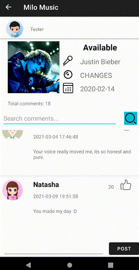
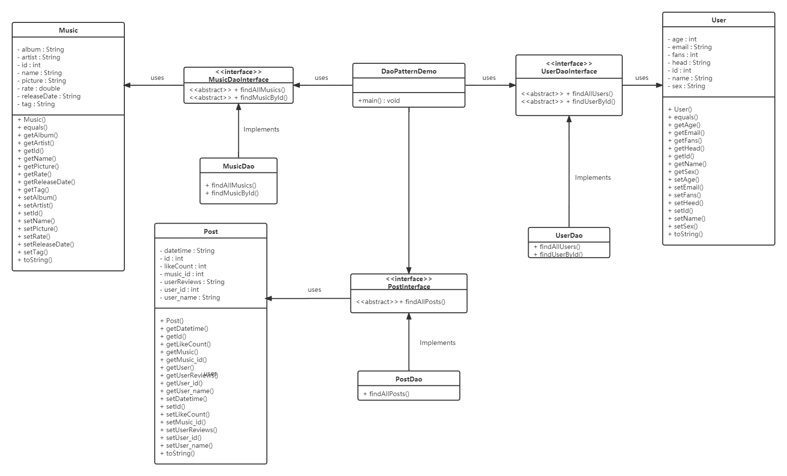
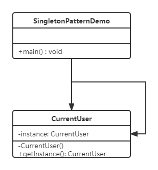
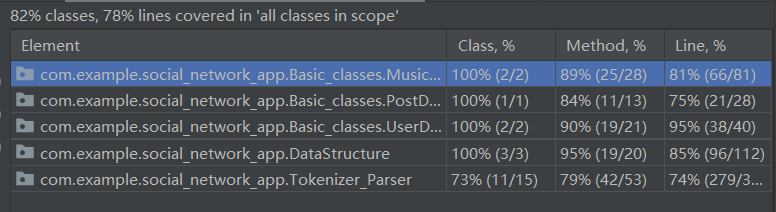

# [Group15 Barbecue Sauce] Report

## Table of Contents

1. [Team Members and Roles](#team-members-and-roles)
2. [Conflict Resolution Protocol](#conflict-resolution-protocol)
2. [Application Description](#application-description)
3. [Application UML](#application-uml)
3. [Application Design and Decisions](#application-design-and-decisions)
4. [Summary of Known Errors and Bugs](#summary-of-known-errors-and-bugs)
5. [Testing Summary](#testing-summary)
6. [Implemented Features](#implemented-features)
7. [Team Meetings](#team-meetings)

## Team Members and Roles

| UID | Name | Role |
| :--- | :----: | ---: |
| u7211790 | Yuhui Pang | Team leader, Developer |
| u7167784 | Man Jin | GUI designer, Developer |
| u7238342 | Hang Su | Data architect, Developer |
| u6819217 | Qihong Zeng | Developer, Tester, GUI designer |

## Conflict Resolution Protocol

### Conflict with a Team member

Any conflict that arises with members of the project team will require the individual involved in the conflict to contact the Project Manager. The Project Manager will arrange and facilitate a meeting with the aggrieved parties accompanied by a detailed description of each individual's comments and concerns. If the conflict in question involves the Project Manager then a Team Member who is not involved in the conflict will fill the role of Project Manager for the purposes of resolving this specific conflict. The meeting will begin with each person, in no particular order, individually explaining their concerns and discussing them openly. Notes will be taken throughout this process including key comments and desired outcomes. The purpose of this meeting is for all parties to come to a mutual understanding and reach a resolution to the aforementioned conflict. If a solution cannot be agreed upon, the conflict will be escalated and require mediation as described in the Mediation part.

### Conflict with the Convenor

Any conflict that arises with the Convenor will require the individual, or individuals, involved in the conflict to contact the Project Manager. The Project Manager will arrange and facilitate a meeting with the aggrieved parties accompanied by a detailed description of each individual's comments and concerns. If the conflict in question involves the Project Manager then a Team Member who is not involved in the conflict will fill the role of Project Manager for the purposes of resolving this specific conflict. The meeting will begin with each person, in no particular order, individually explaining their concerns and discussing them openly. Notes will be taken throughout this process including key comments and desired outcomes. The purpose of this meeting is for all parties to come to a mutual understanding and reach a resolution to the aforementioned conflict. If a solution cannot be agreed upon, the conflict will be escalated and require mediation as described in the Mediation part.

### Mediation

In the unlikely event that an event of conflict can not be resolved it will require mediation from a third party. This can be at the request of the aggrieved parties if they believe they can not resolve the conflict through the usual means. It is the responsibility of the Project Manager to organise an appropriate person to undertake mediation. If there is a conflict of interest with the Project Manager, the next appropriate individual will be the Assessor followed by the Course Convenor.

## Application Description

MiloMusic is a music social media application specifically targeting all people who love music. It provides three parts for them, which are music, comments, and user.

- In the music part, a list of songs are showed in descending order of date or score. Therefore, user can get the latest and highest score song. User also can search songs by four methods.
- In the comments part, user can view posts on a timeline activity (update every 3 seconds). Similarly, user can search comments by three methods. In addition, user can post their comments.
- The user part is open for every users, user can view their comments and a report for their activities.

<center class="third">



</center>


<center class="half">


</center>

**Application Use Cases and or Examples**

Dennis wants to get the most popular song in the playlist and see the comments

1. He accesses the MiloMusic application and goes to the music page
2. He clicks the Rate button and see the top 1 song
3. He chooses the "Perfect" written by Ed Sheeran and goes to the comments page

Mia wants to search the "blues" style and rate greater than "4.2" songs

1. She accesses the MiloMusic application and goes to the music page
2. She types "#blues;*>4.2" in the search box

Nancy wants to see her friends Dennis's comments that write for "End Game" and give him a like reaction

1. She accesses the MiloMusic application and goes to the comments page
2. She types "@Dennis" in the search box
3. She clicks the like button in the first comment by Dennis.

Dennis wants to see her own user report and views it in a landscape screen

1. He click his own avatar in the music page or comment page
2. He sees a "SHOW REPORT" button and clicks it
3.  His report shows number of fans, number of comments per month and number of likes received from comments posted per month
4. He adjusts his phone in the landscape mode

## Application UML


## Application Design and Decisions

**Data Structures**

1. RBtree
    * Objective: It is used for storing MusicRate, MusicDate, PostLikeCountand PostDate for searching feature.
    * Locations: line 32-35 in *GlobalVariable.java*
    * Reasons:
        * *It is more efficient than Arraylist for insertion with a time complexity O(1).*
        * *We don't need to access the item by index for this feature.*
        * *We can use this data structure to sort and search quickly.*
2. LinkedList
   * Objective: It is used for storing post for posting feature.
   * Locations: line28 in *GlobalVariable.java*, line 52-56 in *CommentActivity.java*, line 37 in *UserActivity.java*.

   * Reasons:
     * *It is more efficient than Arraylist for insertion and deletion with a time complexity O(1)*
3. ArrayList
   * Objective: It is used for storing music and user for viewing feature.
   * Locations: line29-30 in *GlobalVariable.java*, line 50 in *MainActivity.java*, line40 in *UserActivity.java*.

   * Reasons:
     * *It is more efficient than Arraylist for direct access with a time complexity O(1)*
     * *We don't need to access insertion and deletion for this feature.*
4. TreeMap
   * Objective: It is used for storing monthly data for reporting feature.
   * Locations: line48-49 in *BarActivity.java*.

   * Reasons:
     * *The month is key, and the corresponding data is value. The data of each month can be obtained through key* 
     
     * *All elements in TreeMap have a fixed order*

**Design Patterns**

1. DAO
   
   Use DAO design pattern when reading music, user and post data from file. Data access object (DAO) pattern is used to separate low-level data access APIs or operations from high-level business services.
   We create *Music.java*, *MusicDAO.java* and *MusicDaoInterface.java* for getting music data;
   ​		           *User.java*, *UserDAO.java* and *UserDaoInterface.java* for getting  user data;
   ​		           and *Post.java*, *PostDAO.java* and *PostDaoInterface.java* for getting  user data;
   
    - The interface defines the standard operations to be performed on a model object.
    - The Dao class implements the above interface. This class is responsible for obtaining data from the data source (JSON & XML file).
    - The object class is a simple POJO and contains the get & set method to store the data retrieved by using the Dao class.

The UML of these three Dao design patterns are like following figures:


When we want to get the date, just execute the method of *findAllxxx()*.

2. Singleton
   
   The singleton design pattern is to ensure a class only has one instance, and provide a global point of access to it.
   In the project, there is only one current user at a time, and the class should create its own unique instance.  So we can use the singleton design pattern to design the CurrentUser class.

   The UML of this singleton design pattern is like following figure:



Singleton design pattern can control the number of instances, save system resources, and avoid frequent creation and destruction of a globally used class.

**Grammars**

1. Music search Engine

   Production Rules:

```
<exp> ::= <term> ; <exp>
<term> ::= <symbol> <factor> | <text>
<symbol> ::= # | @ | *
<factor> ::= <operator> <decimal> | <text>
<operator> ::= > | < | = | >= | <=
<decimal> ::= <number> | <number> . <number>
<number> ::= <digit> | <digit> <number>
<digit> ::= 0|1|2|3|4|5|6|7|8|9
<text> :: = <alpha> <text> | <alpha>
<alpha> :: = a | b | c | d | e | f | g | h | i | j | k | l | m | n | o | p | q | r | s | t | u | v | w | x | y | z
```

2. Comment search Engine

   Production Rules:

```
<exp> ::= <term> ; <exp>
<term> ::= <symbol> <factor> | <text>
<symbol> ::= @ | *
<factor> ::= <operator> <number> | <text>
<operator> ::= > | < | = | >= | <=
<number> ::= <digit> | <digit> <number>
<digit> ::= 0|1|2|3|4|5|6|7|8|9
<text> :: = <alpha> <text> | <alpha>
<alpha> :: = a | b | c | d | e | f | g | h | i | j | k | l | m | n | o | p | q | r | s | t | u | v | w | x | y | z
```

The grammar built by the different search input styles.
Music search and comments input style:

- Users can apply different rules for the music search and comments search.
- For the music search, there are 4 attributes can be a searched, which are music tag, musician,  rate and music name.  Each rules can be linked with ";". The beginning of each attributes should have different symbols. For example, "#musictag;@musician;*>4.2". You also can search music name directly.
- Similar with comments input rule, there are 3 attributes can be a searched, which are user name,  like numbers and comment contents.  Each rules can be linked with ";". The beginning of each attributes should have different symbols. For example, "@username;*>200". You also can search comment contents directly.
- For the music name or comment contents, user can only type some of letters to get which music name or comment contents contain the typing letters.
- For the rate and like numbers, it is linked with 5 operators, which are ">" "<" "="  ">=" "<=", and for rate, user can search the rate in an integer or a decimal number (such as 4.2).
- User can search the rules at the same time or just choose some of them to search.
- The rules are case insensitive.

The advantages of the designs are users can easily to search and to get what the want quickly by typing simple symbols. In addition, the grammar can transfer the input string into many tokens, and searching in the specific data structure.

**Tokenizer and Parsers**

- We use Tokenizers and Parses when searching for musics and posts.
- The Parser can convert String information into conditional tokens based on the string entered by the user,  It then calls the isMatched method to see if it matches.  
- The Parser encapsulates the analysis process and makes it easy to call it externally without doing tedious string processing  

**Surprise Item**

- Sort items returned for a given search
  - User can sort songs by rate or date by ascending and descending.

- Removing/hiding hate speech in posts
- Allowing users to view posts that were filtered out from their timeline
  - User can view which comments they post for different songs. When click the user in the timeline, we can see that person comments for different songs.

**Other**

1. Data Generate

   - Randomly generate a specified number of posts and save them as a xml file.

## Summary of Known Errors and Bugs

1. Bug 1:
    - *Frequent and rapid rotation of the screen and clicking will flash back during real moblie phone simulation*

## Testing Summary

*Basic Class*

- *Number of test cases: 19*

- *Code coverage: 84%*

*Data Structure*

- *Number of test cases: 10*

- *Code coverage: 85%*

*Tokenizer and Parser*

- *Number of test cases: 56*

- *Code coverage: 74%*


The total Test coverage graph screenshot：


## Implemented Features

*Basic App*

| No   | Requirements                                                | Status    | Implemented feature                        | Difficulty |
| ---- | ----------------------------------------------------------- | --------- | ------------------------------------------ | ---------- |
| 1    | Login and Sign up. User can be able to login an sign up     | Completed | Login and sign up                          | Basic      |
| 2    | One fully implemented data structure taught in this course  | Completed | *RBtree*                                   | Basic      |
| 3    | Search functionality that makes use of tokenizer and parser | Completed | Use of tokenizer and parser                | Basic      |
| 4    | Two design pattern                                          | Completed | *DAO* patter and *singleton* pattern       | Basic      |
| 5    | Data file with at least 1,000 valid data instances          | Completed | Data file with 1,500 random data instances | Basic      |
| 6    | Load and view posts and  retrieve data from a local file    | Completed | Load and view post                         | Basic      |

*Advanced features*

| No   | Requirements                                                 | Status              | Implemented feature                                          | Difficulty |
| ---- | ------------------------------------------------------------ | ------------------- | ------------------------------------------------------------ | ---------- |
| 1    | Read data instances from multiple local file in different formats | Completed           | Make use of *json*, *csv* and *xml* file                     | Easy       |
| 2    | UI can support for different scree size and have portrait and landscape layout variants | Completed           | UI including Login, register, main interface can switch between portrait and landscape layout in different screen size | Easy       |
| 3    | User profile activity containing a media file                | Completed           | Different users have different avatars                       | Easy       |
| 4    | Use GPS Information                                          | Completed           | GPS information is on the right side of the user's profile picture | Easy       |
| 5    | The ability to micro-interact with 'posts'.                  | Completed           | User can like a post, having a UI feedback. And user can post a new post. | Easy       |
| 6    | User statistics. Provide users with the ability to see a report of total views, total followers, total posts, total likes, in a graphical manner | Completed           | Total like, total posts and total followers of users can be seen with bar graph in user report | Medium     |
| 7    | Search functionality can handle partially valid and invalid search queries | Completed           | The parser can identify valid and invalid search queries and return a valid search query | Medium     |
| 8    | Provide users with the ability to message each other directly | Partially completed | It is possible to send one-to-many messages, not peer-to-peer message | Hard       |

*Surprise*

| No   | Requirements                                                | Status    | Implemented feature                                          | Difficulty |
| ---- | ----------------------------------------------------------- | --------- | ------------------------------------------------------------ | ---------- |
| 1    | Sort items returned for a given search                      | Completed | User can sort songs by rate or date by ascending and descending | *Surprise* |
| 2    | Removing/hiding hate speech in posts                        | Completed | *Hate speech in posts will be removed*                       | *Surprise* |
| 3    | Search functionality that makes use of tokenizer and parser | Completed | User can view which comments they post for different songs. When click the user in the timeline, we can see that person comments for different songs | *Surprise* |

## Team Meetings

- *[Team Meeting 1](./meeting/meeting1.md)*
- *[Team Meeting 2](./meeting/meeting2.md)*
- *[Team Meeting 3](./meeting/meeting3.md)*
- *[Team Meeting 4](./meeting/meeting4.md)*
- *[Team Meeting 5](./meeting/meeting5.md)*
